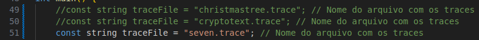

# tlb-failure-rate
Análise da taxa de falhas da TLB (Translation Lookaside Buffer) utilizando traces de memória gerados com a ferramenta Valgrind. Os passos descritos a seguir devem ser executados na raiz do projeto.

# Passo 1: Compilar
Executar os comandos:

``g++ codigos/christmastree.cpp -o codigos/christmastree``
``g++ codigos/cryptotext.cpp -o codigos/cryptotext``
``g++ codigos/seven.cpp -o codigos/seven``

## Passo 2: Gerar os traces
Executar os comandos:

``valgrind --log-file=christmastree.trace --tool=lackey --trace-mem=yes ./codigos/christmastree``

``valgrind --log-file=cryptotext.trace --tool=lackey --trace-mem=yes ./codigos/cryptotext``

``valgrind --log-file=seven.trace --tool=lackey --trace-mem=yes ./codigos/seven``

## Passo 3: Usando o simulador para obter a taxa de erros das TLBs de instrução e dados

Entre as linhas 49-51, descomentar a linha com o nome do arquivo que se deseja analisar os traces.

Recompilar e executar com os comandos
``g++ tlbsimulator.cpp -o tlbsimulator``
``./tlbsimulator``